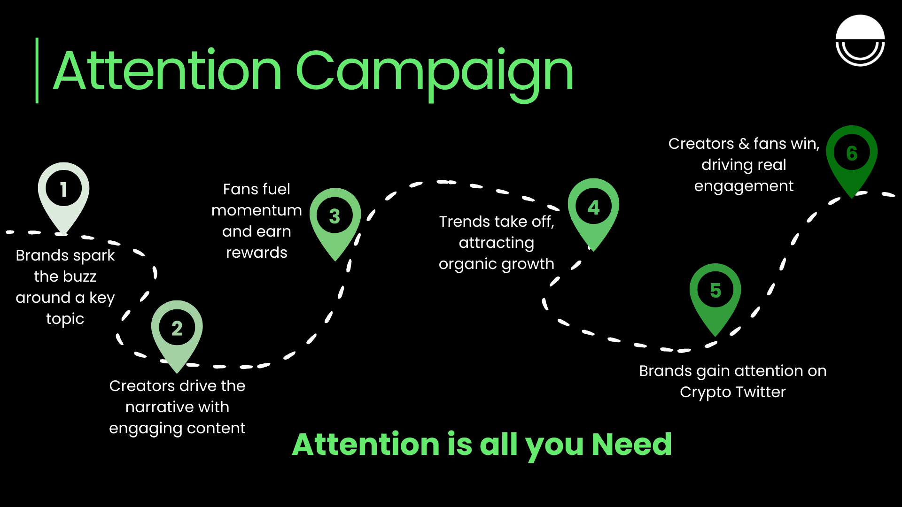

## Overview

Attention Campaigns are a powerful way for brands to **spark buzz, activate creators, and reward real fans** — all tracked verifiably on-chain.

Unlike typical ad spends or engagement farming, this model **shares value directly with the people who actually create attention.**  
Whether it’s a launch, poll, or trend — you control the narrative.

---

## Campaign Flow

<Frame>

</Frame>

1. **Brands spark a topic**  
   Set a clear prompt, theme, or question (e.g. *"Should we launch on Monad?"*).

2. **Creators drive the narrative**  
   Creators post content aligned with the campaign to kickstart the buzz.

3. **Fans fuel momentum**  
   The community joins in — replying, resharing, tagging others — and earns a share of attention.

4. **Trends take off**  
   With enough participation, the campaign reaches organic virality.

5. **Brands get verifiable attention**  
   Real-time dashboards show which creators and fans drove the most traction.

6. **Everyone wins**  
   Creators grow. Fans get rewarded. Brands gain mindshare and signal.

---

## Why It Works

- **No long-term commitment** – Brands launch and end campaigns anytime.
- **Fully transparent** – All data is on-chain and verifiable.
- **Fair distribution** – 100% of rewards go to users and creators, not the platform.
- **Plug & play** – Works on top of existing social media.

---

## Example

> ORA Protocol ran a campaign asking fans “Which L2 should we launch on?”  
> Creators shared takes. Fans replied. Top voices rose.  
> ORA rewarded attention points to the top contributors — and got valuable sentiment + visibility in return.

---

## Who can launch?

- **Protocols** – Community-driven feature testing
- **DAOs** – Narrative-building before governance proposals
- **Infra teams** – Ecosystem awareness and dev onboarding

<Tip>
  Attention Campaigns are the fastest way to grow an on-chain audience without starting from scratch.
</Tip>
