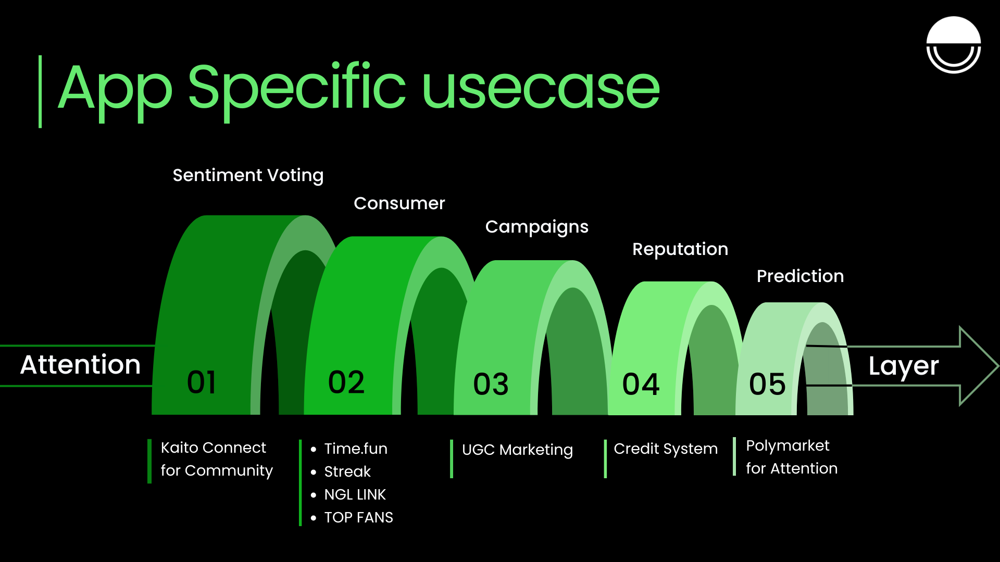

# App-Specific Use Cases

The Attention Layer isn’t just a scoring engine — it's infrastructure.  
You can build entire apps on top of on-chain attention layer.

From viral campaigns to sentiment voting, here's a glimpse of what’s possible:

<CardGroup cols={2}>

<Card
  title="Attention Campaigns"
  icon="bullhorn"
  href="/use-cases/category/attention-campaigns"
>
  Launch brand campaigns where users and creators compete to generate buzz.
</Card>

<Card
  title="Consumer Apps"
  icon="user"
  href="/use-cases/category/consumer-apps"
>
  Streaks, Top Fans, and attention-powered NGL links. Make engagement fun and sticky.
</Card>

<Card
  title="Prediction Markets"
  icon="chart-line"
  href="/use-cases/category/prediction-markets"
>
  Use collective attention as a forecasting signal. Bet on trends before they become obvious.
</Card>

<Card
  title="Reputation Systems"
  icon="star"
  href="/use-cases/category/reputation-systems"
>
  Turn attention into social credit. Let engagement shape trust and influence on-chain.
</Card>

<Card
  title="Sentiment Voting"
  icon="thumbs-up"
  href="/use-cases/category/sentiment-voting"
>
  Let communities vote with their attention. Power rankings, preferences, and project momentum.
</Card>

</CardGroup>

---

> Want to build your own use case?
> Head to the [Development](/development) guide and start building with our upcoming SDKs.
